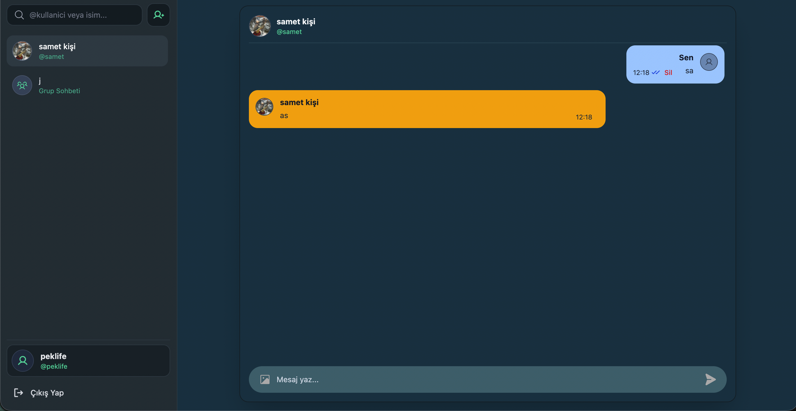
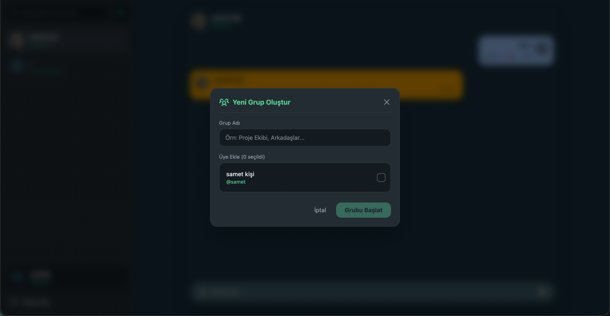
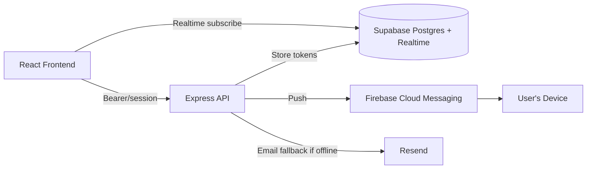

# 💬 Osso — Real-Time Chat App

A full-stack messenger app with real-time 1:1 and group chats, read receipts, and web push notifications — built to go deep on real-time systems, auth architecture, and cross-device notification delivery.

**Live Demo:** [osso-chat.vercel.app](https://osso-chat.vercel.app)

## ✨ Features

- 1:1 and group conversations
- Real-time message delivery via Supabase Realtime (`postgres_changes` on the messages table)
- Read receipts (delivered / seen indicators)
- Message delete
- Online presence tracking (Supabase Realtime Presence channel)
- Web push notifications via Firebase Cloud Messaging, even when the tab is closed
- Email notifications for offline users when push isn't available (skipped automatically if the recipient is online)
- Session-based authentication

## 📸 Screenshots

| Chat view | NewGroup |
|---|---|
|  |  |

## 🏗️ Tech Stack

**Frontend** (`/frontend`)
- React + TypeScript + Vite
- Zustand (`useChatStore`) for chat/message state
- Tailwind CSS + Phosphor Icons
- Firebase SDK — `firebase-messaging-sw.js` service worker + `getToken()` for push registration

**Backend** (`/backend`)
- Node.js + Express
- PostgreSQL via Supabase (Postgres + Realtime + Presence)
- Better Auth for session-based authentication
- `firebase-admin` for sending push notifications (`getMessaging().send()`)
- Resend for transactional email notifications

## 🔔 Notifications Architecture

- Frontend registers the `firebase-messaging-sw.js` service worker, waits for it to reach the `activated` state, then requests an FCM token via `getToken()`
- Token is POSTed to `/api/push-subscribe` and stored in a Supabase `push_tokens` table, keyed by user
- On new message, backend sends push via `firebase-admin`, and sends an email via Resend **only if the recipient is currently offline** (checked against the Realtime Presence channel)
- Push and email delivery are decoupled — a failing email send never blocks the push notification

## 🧭 Architecture



## ⚡ Getting Started

### Prerequisites
- Node.js 18+
- A Supabase (PostgreSQL) project with Realtime enabled
- A Firebase project (Cloud Messaging enabled) and service account key
- A Resend account (for email fallback notifications)

### 1. Backend

```bash
cd backend
npm install
cp .env.example .env   # fill in Supabase, Better Auth, Firebase Admin, and Resend credentials
npm start
```

### 2. Frontend

```bash
cd frontend
npm install
cp .env.example .env   # point this at your backend URL + Firebase web config
npm run dev
```

## 🔧 Environment Variables

**Backend**
| Variable | Description |
|---|---|
| `DATABASE_URL` | Supabase/PostgreSQL connection string |
| `BETTER_AUTH_SECRET` | Secret used to sign sessions |
| `FIREBASE_SERVICE_ACCOUNT` | Firebase Admin SDK service account credentials |
| `RESEND_API_KEY` | For sending fallback email notifications |

**Frontend**
| Variable | Description |
|---|---|
| `VITE_API_URL` | Base URL of the backend API |
| `VITE_FIREBASE_CONFIG` | Firebase web app config (for FCM) |

## 🧯 Troubleshooting

- **Push token `AbortError`** — the service worker wasn't `activated` yet when `getToken()` was called; wait for the `activated` state first.
- **Push not arriving for a specific account** — check that `push_tokens` upserts are scoped correctly; testing multiple accounts in the same browser can overwrite each other's token row if the FCM token itself isn't distinguished per account.
- **Emails not arriving to non-test addresses** — Resend sandbox mode only delivers to the account's own verified address until a sending domain is verified.

## 🗺️ Roadmap / Known Limitations

- Email sending is limited by Resend's sandbox mode until a custom domain is verified
- No message search yet

